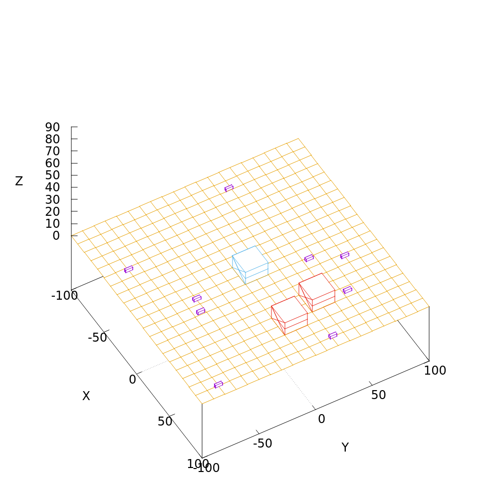

# Wirtualny Łazik
Prosta aplikacja stworzona w C++ i gnuplocie.



## Spis treści
* [Ogólne informacje](#ogólne-informacje)
* [Technologie](#technologie)

## Ogólne informacje
Celem projektu jest zapoznanie się z programowaniem obiektowym w C++ oraz aplikacją graficzną gnuplot. Aplikacja służy do prostego obsługiwania wirtualnego łazika poruszajacego się po generowanym terenie.

## Technologie
* C++11
* gnuplot version 5.4

## Ustawianie
Aby uruchomić aplikację, zainstaluj aplikację gnuplot a następnie:

```
$ cd ../Lazik/prj
$ make
```
## Źródła
Projekt powstał na potrzeby zajęć u Dr. inż Bogdana Kreczmera przy pomocy pliku jego własności, który służy do komunikacji aplikacji z oprogramowaniem gnuplot (plik "/Lazik/prj/src/lacze_do_gnuplota.cpp").
